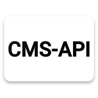
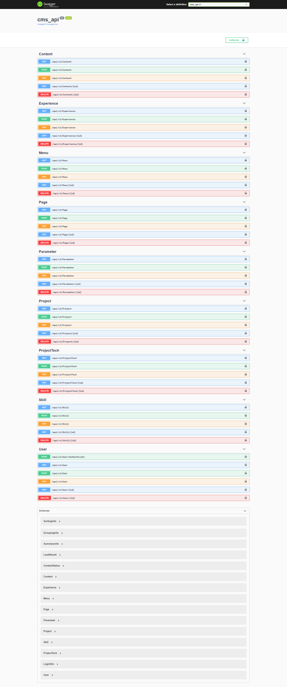

[![Contributors][contributors-shield]][contributors-url]
[![Forks][forks-shield]][forks-url]
[![Stargazers][stars-shield]][stars-url]
[![Issues][issues-shield]][issues-url]
[![MIT License][license-shield]][license-url]
[![LinkedIn][linkedin-shield]][linkedin-url]


<!-- PROJECT LOGO -->
<br />
<p align="center">
  <a href="https://github.com/necmettincimen/cms-api">
    
  </a>

  <h3 align="center">CMS-API</h3>

  <p align="center">
    Developer Content Managment Api
    <br />
    <a href="https://github.com/necmettincimen/cms-api"><strong>Explore the docs »</strong></a>
    <br />
    <br />
    <a href="https://cms-api.necmettincimen.xyz/index.html">View Demo</a>
    ·
    <a href="https://github.com/necmettincimen/cms-api/issues">Report Bug</a>
    ·
    <a href="https://github.com/necmettincimen/cms-api/issues">Request Feature</a>
  </p>
</p>


<!-- TABLE OF CONTENTS -->
<details open="open">
  <summary>Table of Contents</summary>
  <ol>
    <li>
      <a href="#about-the-project">About The Project</a>
      <ul>
        <li><a href="#built-with">Built With</a></li>
      </ul>
    </li>
    <li>
      <a href="#getting-started">Getting Started</a>
      <ul>
        <li><a href="#prerequisites">Prerequisites</a></li>
        <li><a href="#installation">Installation</a></li>
      </ul>
    </li>
    <li><a href="#publish">Publish & Release on Docker</a></li>
    <li><a href="#roadmap">Roadmap</a></li>
    <li><a href="#contributing">Contributing</a></li>
    <li><a href="#license">License</a></li>
    <li><a href="#contact">Contact</a></li>
    <li><a href="#acknowledgements">Acknowledgements</a></li>
  </ol>
</details>


<!-- ABOUT THE PROJECT -->
## About The Project



Developer Content Managment Api

A list of commonly used resources that I find helpful are listed in the acknowledgements.

### Built With

This section should list any major frameworks that you built your project using. Leave any add-ons/plugins for the acknowledgements section. Here are a few examples.
* [Net Core](https://github.com/dotnet/core)
* [Sqlite](https://www.sqlite.org/index.html)


<!-- GETTING STARTED -->
## Getting Started

This is an example of how you may give instructions on setting up your project locally.
To get a local copy up and running follow these simple example steps.

### Prerequisites

This is an example of how to list things you need to use the software and how to install them.
* dotnet
  ```sh
  download & install https://dotnet.microsoft.com/download/dotnet/thank-you/sdk-5.0.101-windows-x64-installer
  ```

### Installation

1. Clone the repo
   ```sh
   git clone https://github.com/necmettincimen/cms-api.git
   ```
   Goto Api Directory
   ```sh
   cd cms-api && cd API
   ```
2. Run Project
   ```sh
   dotnet run
   ```
3. Goto
   ```HTML
   https://localhost/swagger
   ```

### Publish & Release on Docker

1. Clone the repo
   ```sh
   git clone https://github.com/necmettincimen/cms-api.git
   ```
   Goto Api Directory
   ```sh
   cd cms-api && cd API
   ```
2. Build Image
   ```sh
   docker build -t cms-api .
   ```
3. Create Container 
   ```sh
   docker run -d --restart always --name cms-api -p 87:80 cms-api
   ```


<!-- ROADMAP -->
## Roadmap

See the [open issues](https://github.com/necmettincimen/cms-api/issues) for a list of proposed features (and known issues).


<!-- CONTRIBUTING -->
## Contributing

Contributions are what make the open source community such an amazing place to be learn, inspire, and create. Any contributions you make are **greatly appreciated**.

1. Fork the Project
2. Create your Feature Branch (`git checkout -b feature/AmazingFeature`)
3. Commit your Changes (`git commit -m 'Add some AmazingFeature'`)
4. Push to the Branch (`git push origin feature/AmazingFeature`)
5. Open a Pull Request


<!-- LICENSE -->
## License

Distributed under the MIT License. See `LICENSE` for more information.


<!-- CONTACT -->
## Contact

Necmettin Çimen - [@Necmettin Cimen](https://necmettincimen.github.io) - [necmettin.dev@gmail.com](mailto:necmettin.dev@gmail.com)

Project Link: [https://github.com/necmettincimen/cms-api](https://github.com/necmettincimen/cms-api)


<!-- ACKNOWLEDGEMENTS -->
## Acknowledgements
* [Net Core](https://en.wikipedia.org/wiki/.NET_Core)
* [Sqlite](https://en.wikipedia.org/wiki/SQLite)


<!-- MARKDOWN LINKS & IMAGES -->
<!-- https://www.markdownguide.org/basic-syntax/#reference-style-links -->
[contributors-shield]: https://img.shields.io/github/contributors/necmettincimen/cms-api.svg?style=for-the-badge
[contributors-url]: https://github.com/necmettincimen/cms-api/graphs/contributors
[forks-shield]: https://img.shields.io/github/forks/necmettincimen/cms-api.svg?style=for-the-badge
[forks-url]: https://github.com/necmettincimen/cms-api/network/members
[stars-shield]: https://img.shields.io/github/stars/necmettincimen/cms-api.svg?style=for-the-badge
[stars-url]: https://github.com/necmettincimen/cms-api/stargazers
[issues-shield]: https://img.shields.io/github/issues/necmettincimen/cms-api.svg?style=for-the-badge
[issues-url]: https://github.com/necmettincimen/cms-api/issues
[license-shield]: https://img.shields.io/github/license/necmettincimen/cms-api.svg?style=for-the-badge
[license-url]: https://github.com/necmettincimen/cms-api/blob/master/LICENSE.txt
[linkedin-shield]: https://img.shields.io/badge/-LinkedIn-black.svg?style=for-the-badge&logo=linkedin&colorB=555
[linkedin-url]: https://linkedin.com/in/necmettincimen
[product-screenshot]: images/screenshot.png